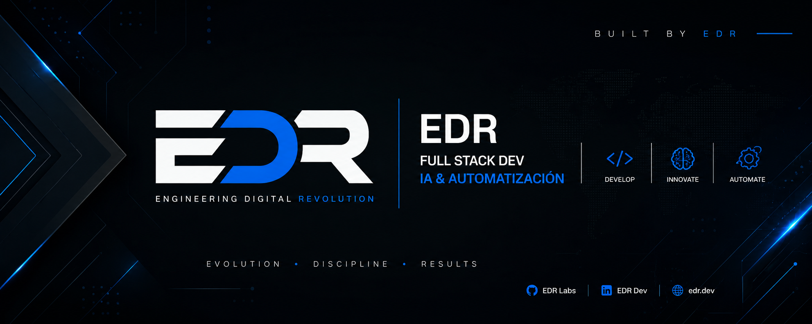

# Portafolio Personal — Edgardo Ramírez Canales

Sitio web de portafolio profesional moderno, responsivo y autoalojado en Vercel. Arquitectura limpia con separación de concernimientos (HTML, CSS, JavaScript).

**Sitio en vivo:** [www.edgardo-ramirez.com](https://www.edgardo-ramirez.com)

## 📋 Descripción

Portafolio de Edgardo Ramírez, Ingeniero en Sistemas. Presenta habilidades técnicas, experiencia profesional, proyectos destacados e información de contacto. Diseño dark mode moderno con animaciones suaves y tipografías Inter y Fira Code.

## 🛠️ Tecnologías

- **HTML5** — Estructura semántica
- **CSS3** — Variables CSS, Grid, Flexbox, animaciones, media queries responsivas
- **JavaScript vanilla** — Event listeners, DOM manipulation
- **Google Fonts** — Inter, Fira Code
- **Vercel** — Hosting estático y despliegue automático

## 📁 Estructura del proyecto

```
PORTAFOLIO_EDGARDO_RAMIREZ/
├── index.html          # Página principal (HTML + estructura)
├── styles.css          # Estilos globales (~143 líneas)
├── main.js             # Lógica interactiva (event listeners)
├── BannerEDR.png       # Marca personal (1.2 MB)
└── README.md           # Documentación
```

## ✨ Características

- ✅ **Responsivo** — Diseño adaptable a mobile, tablet y desktop
- ✅ **Dark mode** — Paleta de colores oscura con acentos cian y púrpura
- ✅ **Modular** — Código separado en archivos independientes
- ✅ **Sin dependencias** — HTML/CSS/JS vanilla, cero librerías externas
- ✅ **Optimizado** — Estilos organizados, eventos delegados
- ✅ **Desplegado** — CI/CD automático con Vercel

## 🚀 Cómo usar

### Localmente
1. Clonar el repositorio:
   ```bash
   git clone https://github.com/Edgardo-Ramirez-Canales/EARC_2026_PORTAFOLIO_EDR.git
   cd EARC_2026_PORTAFOLIO_EDR
   ```

2. Abrir en el navegador:
   ```bash
   # Con Live Server (VS Code)
   # O simplemente abre index.html en tu navegador
   ```

### En producción
El sitio se despliega automáticamente en Vercel al hacer push a `main`:
- **Rama:** `main`
- **URL de producción:** https://www.edgardo-ramirez.com
- **DNS:** Cloudflare CNAME → Vercel

## 📐 Secciones

- **Hero** — Presentación principal con llamada a acción
- **About** — Información personal y estadísticas
- **Skills** — Habilidades técnicas organizadas por categoría
- **Experience** — Línea de tiempo de experiencia profesional
- **Projects** — Portafolio de proyectos destacados
- **Contact** — Formulario de contacto y enlaces sociales

## 🎨 Personalización

### Colores (en `styles.css`)
Modificar las variables CSS en `:root`:
```css
--accent: #00d4ff;    /* Cian */
--accent2: #7c3aed;   /* Púrpura */
--accent3: #06d6a0;   /* Verde */
```

### Contenido (en `index.html`)
Editar directamente las secciones HTML según tu información.

## 📞 Contacto

**Edgardo Ramírez Canales**  
Ingeniero en Sistemas

📧 [ramirezedgardo92@gmail.com](mailto:ramirezedgardo92@gmail.com)  
🔗 [LinkedIn](#) | [GitHub](#) | [Portfolio](https://www.edgardo-ramirez.com)

## 📄 Licencia

Proyecto personal. Todos los derechos reservados © 2026 Edgardo Ramírez Canales.
